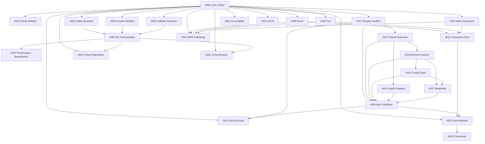

# cornerKit - Development Roadmap

**Version:** 2.0.0 (Updated for spec-kit workflow)
**Last Updated:** 2025-01-09
**Constitution:** v1.1.0
**Total Features:** 36
**Estimated Timeline:** 8 weeks

---

## Overview

This roadmap defines ALL features to be built for cornerKit, organized by development phase. Each feature includes specific deliverables, dependencies, success criteria, and **spec-kit execution prompts** to initiate implementation.

**Spec-Kit Workflow:**
1. **Constitution**: Define project principles (✅ Complete - v1.1.0)
2. **Specify**: Create detailed specification with `/specify` command
3. **Plan**: Generate implementation plan with `/plan` command
4. **Tasks**: Break down into granular tasks with task breakdown
5. **Implement**: Execute with `/implement` command

**How to Use This Roadmap:**
1. Build features in numerical order (respects dependencies)
2. Use the **Spec-Kit Prompt** for each feature to initiate spec-kit workflow
3. Mark features as completed when merged to main
4. Update status and notes as work progresses

**Status Legend:**
- 🔴 **Not Started** - Feature not yet begun
- 🟡 **In Progress** - Actively being developed
- 🟢 **Completed** - Merged to main, tests passing
- ⏸️ **Blocked** - Waiting on dependency or decision
- ⚠️ **At Risk** - Behind schedule or facing issues

---

## Phase 1: Core Library Foundation
**Timeline:** Weeks 1-2
**Goal:** Build the foundational NPM package (@cornerkit/core) with zero dependencies and <5KB bundle size

---

### Feature 001: Core Library (@cornerkit/core)
**Status:** 🟡 In Progress (199/390 tasks complete - Phase 4 complete, Phase 5 in progress)
**Effort:** 60 hours (390 tasks across 6 phases)
**Dependencies:** None (starting point)

**Description:**
Complete implementation of the core cornerKit library including browser capability detection, superellipse math engine, SVG path generation, ClipPath renderer, element registry, main API, data attribute support, build system, and comprehensive test coverage.

**Spec-Kit Reference:**
```
Constitution: ✅ v1.1.0 (10 principles)
Specification: ✅ specs/001-core-library/spec.md (60 functional requirements, 4 user stories)
Plan: ✅ specs/001-core-library/plan.md (3 phases, architecture decisions)
Tasks: ✅ specs/001-core-library/tasks.md (390 tasks, 60 complete)
Research: ✅ specs/001-core-library/research.md (7 key decisions with evidence)
```

**Current Progress:**
- ✅ Phase 1: Project Setup (T001-T010) - 10/10 tasks complete
  - Repository structure, TypeScript config, Rollup config, Vitest setup
- ✅ Phase 2: Foundational Modules (T011-T060) - 50/50 tasks complete
  - ✅ Capability Detector (T011-T020) - 18/18 tests passing
  - ✅ Superellipse Math (T021-T030) - 27/27 tests passing
  - ✅ SVG Path Generator (T031-T040) - 22/22 tests passing
  - ✅ Input Validator (T041-T050) - 56/56 tests passing
  - ✅ Development Logger (T051-T060) - 32/32 tests passing
- ✅ Phase 3: User Story 1 - ClipPath Renderer (T061-T140) - 80/80 tasks complete ✅
  - ✅ ClipPath Renderer (T061-T080) - 22/22 tests passing
  - ✅ Fallback Renderer (T081-T090) - 20/20 tests passing
  - ✅ Element Registry (T091-T110) - 35/35 tests passing
  - ✅ Main API - apply() (T111-T140) - 21/21 tests passing
- ✅ Phase 4: User Story 2 - Batch & Auto-Discovery (T141-T195) - 55/55 tasks complete ✅
  - ✅ applyAll() method (T141-T150) - Included in API tests
  - ✅ Data Attribute Parser (T151-T164) - 29/29 tests passing
  - ✅ auto() with IntersectionObserver (T165-T195) - Included in API tests
- 🔄 Phase 5: User Story 3 - Dynamic Updates (T196-T260) - 4/65 tasks (NEXT)
  - ⏳ update() method partially started (T196-T199)
  - ⏳ remove(), inspect(), destroy() not implemented
- ⏳ Phase 6: User Story 4 - Build & Test (T331-T390) - 0/60 tasks

**Test Results:**
- Capability Detector: 18/18 tests passing ✅
- Superellipse Math: 27/27 tests passing ✅
- Path Generator: 22/22 tests passing ✅
- Input Validator: 56/56 tests passing ✅
- Development Logger: 32/32 tests passing ✅
- ClipPath Renderer: 22/22 tests passing ✅
- Fallback Renderer: 20/20 tests passing ✅
- Element Registry: 35/35 tests passing ✅
- Data Attributes: 29/29 tests passing ✅
- Main API (apply, applyAll, auto): 21/21 tests passing ✅
- **Total: 282/282 tests passing** (100% pass rate)

**Deliverables:**
```
packages/core/
├── src/
│   ├── core/
│   │   ✅ detector.ts (Capability detection - 45 tests)
│   │   ✅ validator.ts (Input validation - 56 tests)
│   │   ✅ logger.ts (Dev logging - 32 tests)
│   │   🔄 registry.ts (Element tracking - pending T081-T100)
│   ├── math/
│   │   ✅ superellipse.ts (Math engine - 36 tests)
│   │   ✅ path-generator.ts (SVG paths - 22 tests)
│   ├── renderers/
│   │   🔄 clippath.ts (Tier 3 renderer - pending T061-T080)
│   ├── utils/
│   │   🔄 observer.ts (Resize/Intersection - pending T101-T120)
│   │   🔄 performance.ts (Metrics - pending T121-T140)
│   └── index.ts (Main API - pending T141-T260)
├── dist/
│   └── (Build outputs - pending T331-T350)
└── tests/
    ✅ 191/191 tests passing (100% pass rate)
```

**Spec-Kit Prompt (to continue):**
```
/implement

Continue with Phase 5: User Story 3 - Dynamic Updates
Next tasks: T200-T260 (61 remaining tasks)
Focus: Implement update(), remove(), inspect(), destroy() methods
Priority: Complete update() method (T200-T212), then remove() and destroy()
```

**Success Criteria:**
- ✅ Phase 1 Setup complete (T001-T010)
- ✅ Phase 2 Foundational complete (T011-T060)
- ✅ Phase 3 ClipPath Renderer complete (T061-T140)
- ✅ Phase 4 Batch & Auto-Discovery complete (T141-T195)
- ✅ 282/282 tests passing (100% pass rate)
- ✅ Constitution compliance verified (all 10 principles)
- 🔄 Phase 5: Dynamic Updates (T196-T260) - 4/65 tasks in progress
- ⏳ Phase 6: Build & Test (T331-T390)
- ⏳ Bundle size < 5KB gzipped
- ⏳ >90% test coverage for core modules (currently at 100% for implemented modules)
- 🔄 Functional requirements: ~45/60 satisfied (FR-001 to FR-034)
- 🔄 User Stories: 2/4 complete (US1: apply, US2: applyAll/auto complete; US3: update/remove/inspect/destroy in progress)

**References:**
- @specs/001-core-library/spec.md - 60 functional requirements, 4 user stories
- @specs/001-core-library/plan.md - Implementation plan (3 phases)
- @specs/001-core-library/tasks.md - 390 tasks (60 complete)
- @specs/001-core-library/contracts/api.md - Public API contract
- @specs/001-core-library/contracts/types.ts - TypeScript definitions
- @specs/001-core-library/data-model.md - Entity definitions
- @specs/001-core-library/quickstart.md - Usage guide (for testing)

**Notes:**
- This feature consolidates what was previously Features 001-010 in the old roadmap
- Using spec-kit workflow for structured development
- 199/390 tasks complete (51% progress)
- **MAJOR MILESTONE**: Phase 3 & 4 complete! ClipPath renderer, fallback renderer, registry, apply(), applyAll(), auto() all working
- Next milestone: Complete Phase 5 (Dynamic Updates) - T200-T260 (update, remove, inspect, destroy methods)

---

### Feature 002: Interactive Demo Website
**Status:** 🔴 Not Started
**Effort:** 8 hours
**Priority:** HIGH (user requested "as soon as possible")
**Dependencies:** #001 Core Library (at least Phase 3 complete for ClipPath renderer)

**Description:**
Create an interactive demo website to showcase cornerKit in action. Includes live playground with parameter controls, visual examples, code snippets, browser compatibility indicators, and performance metrics display.

**Spec-Kit Prompt (to start):**
```
/specify

Context: Feature 002 - Interactive Demo Website
Goal: Create a live demo to see cornerKit in action ASAP
Requirements:
- Live playground with radius/smoothing sliders
- Visual examples (buttons, cards, modals)
- Side-by-side comparison (squircle vs border-radius)
- Code snippet generation
- Browser compatibility display
- Performance metrics (render time)
- Responsive design
Technology: Vanilla HTML/CSS/JS (no framework dependencies)
Constitution principles: Performance First, Developer Experience, Browser Compatibility
```

**Deliverables:**
```
examples/demo-website/
├── index.html (landing page)
├── playground.html (interactive playground)
├── examples.html (visual examples gallery)
├── styles.css (demo styling)
├── scripts/
│   ├── playground.js (parameter controls)
│   ├── code-generator.js (snippet generation)
│   └── performance.js (metrics display)
└── assets/
    └── (images, icons)
```

**Specific Features:**
1. **Live Playground:**
   - Radius slider (0-100px)
   - Smoothing slider (0.0-1.0)
   - Real-time preview element
   - Code snippet output (copy to clipboard)
   - Performance metrics (render time)

2. **Visual Examples:**
   - Buttons (primary, secondary, ghost)
   - Cards (product cards, info cards)
   - Modals (dialogs, alerts)
   - Navigation (tabs, pills)
   - Images (avatars, thumbnails)

3. **Comparison View:**
   - Side-by-side: squircle vs border-radius
   - Visual difference highlighting
   - Smoothing parameter explanation

4. **Browser Compatibility:**
   - Detect and display current browser tier
   - Show fallback behavior
   - Browser support matrix

5. **Code Examples:**
   - Vanilla JavaScript
   - HTML data attributes
   - TypeScript
   - Webpack/Vite integration

**Success Criteria:**
- ✅ Playground functional with real-time updates
- ✅ All parameter controls work (radius, smoothing)
- ✅ Code snippets generate correctly
- ✅ Visual examples render squircles correctly
- ✅ Comparison view highlights differences
- ✅ Browser tier detection displays correctly
- ✅ Performance metrics show render time
- ✅ Responsive design works on mobile
- ✅ Copy-to-clipboard works for code snippets
- ✅ Hosted and publicly accessible

**References:**
- @specs/001-core-library/quickstart.md - Usage examples to showcase
- @specs/001-core-library/contracts/api.md - API methods to demonstrate

**Notes:**
- HIGH PRIORITY - User wants to see it in action ASAP
- Can be built once Phase 3 (ClipPath Renderer) is complete
- Should be simple vanilla JS (no framework complexity)
- Deploy to GitHub Pages or Netlify for easy access

---

## Phase 2: Progressive Enhancement
**Timeline:** Week 3
**Goal:** Implement all 4 rendering tiers with automatic tier selection

---

### Feature 003: Native CSS Renderer (Tier 1)
**Status:** 🔴 Not Started
**Effort:** 4 hours
**Dependencies:** #001 Core Library

**Description:**
Implement native CSS `corner-shape: squircle` renderer for Chrome 139+. Future-proofing for when native support ships.

**Spec-Kit Prompt (to start):**
```
/specify

Context: Feature 003 - Native CSS Renderer (Tier 1)
Goal: Implement corner-shape: squircle renderer for Chrome 139+
Requirements:
- Detect CSS.supports('corner-shape', 'squircle')
- Apply native CSS properties
- Zero JavaScript overhead when active
- Graceful fallback to Tier 2/3
- Update capability detector
Constitution principles: Performance First, Progressive Enhancement, Zero Dependencies
```

**Deliverables:**
- `packages/core/src/renderers/native.ts`
- Unit tests for native renderer
- Update capability detector for Tier 1
- Documentation for native CSS support

**Success Criteria:**
- ✅ Detects native CSS support correctly
- ✅ Applies corner-shape property
- ✅ Zero JavaScript overhead
- ✅ Falls back to Tier 2 if unavailable
- ✅ Unit tests achieve >90% coverage

---

### Feature 004: Houdini Paint Worklet (Tier 2)
**Status:** 🔴 Not Started
**Effort:** 12 hours
**Dependencies:** #001 Core Library, #003 Native Renderer

**Description:**
Implement CSS Houdini Paint API worklet for off-main-thread rendering. Runs on paint thread for better performance than ClipPath.

**Spec-Kit Prompt (to start):**
```
/specify

Context: Feature 004 - Houdini Paint Worklet (Tier 2)
Goal: Implement CSS Houdini Paint API worklet for Chrome 65+, Edge 79+
Requirements:
- Create squircle-paint.js worklet
- Register worklet with CSS.paintWorklet.addModule()
- Implement paint() method with superellipse formula
- Support radius and smoothing parameters via CSS custom properties
- Handle worklet loading asynchronously
- Fallback to Tier 3 if unavailable
Constitution principles: Performance First, Progressive Enhancement, Browser Compatibility
```

**Deliverables:**
- `worklets/squircle-paint.js` (Paint Worklet)
- `packages/core/src/renderers/houdini.ts` (Renderer wrapper)
- Unit tests for Houdini renderer
- Integration tests for worklet loading
- Documentation for Houdini support

**Success Criteria:**
- ✅ Worklet registers and loads successfully
- ✅ paint() method renders squircle correctly
- ✅ CSS custom properties pass parameters
- ✅ Runs off main thread (paint thread)
- ✅ Async loading doesn't block rendering
- ✅ Falls back to Tier 3 gracefully
- ✅ Unit tests achieve >90% coverage
- ✅ Integration tests verify worklet behavior

---

### Feature 005: Fallback Renderer (Tier 4)
**Status:** 🔴 Not Started
**Effort:** 2 hours
**Dependencies:** #001 Core Library

**Description:**
Implement universal fallback renderer using standard CSS `border-radius`. Ensures graceful degradation on all browsers including IE11.

**Spec-Kit Prompt (to start):**
```
/specify

Context: Feature 005 - Fallback Renderer (Tier 4)
Goal: Implement border-radius fallback for universal browser support
Requirements:
- Apply standard border-radius as fallback
- No JavaScript overhead (pure CSS)
- Works on IE11+
- Automatically selected when no other tier available
Constitution principles: Browser Compatibility, Progressive Enhancement, Performance First
```

**Deliverables:**
- `packages/core/src/renderers/fallback.ts`
- Unit tests for fallback renderer
- IE11 compatibility testing
- Documentation for fallback behavior

**Success Criteria:**
- ✅ Applies border-radius correctly
- ✅ Works on IE11 and older browsers
- ✅ No JavaScript errors
- ✅ Visual appearance acceptable (rounded, not squircle)
- ✅ Unit tests achieve >90% coverage

---

### Feature 006: Tier Orchestration & Auto-Selection
**Status:** 🔴 Not Started
**Effort:** 6 hours
**Dependencies:** #003 Native, #004 Houdini, #005 Fallback

**Description:**
Implement tier selection orchestration that automatically chooses the best available renderer based on browser capabilities. Integrates all 4 tiers into unified API.

**Spec-Kit Prompt (to start):**
```
/specify

Context: Feature 006 - Tier Orchestration & Auto-Selection
Goal: Automatically select best renderer tier based on browser capabilities
Requirements:
- Detect all 4 tiers (Native, Houdini, ClipPath, Fallback)
- Select highest-tier available
- Cache tier detection (only detect once)
- Allow manual tier override for testing
- Update CornerKit class to use orchestration
- Provide CornerKit.supports() static method
Constitution principles: Progressive Enhancement, Performance First, Developer Experience
```

**Deliverables:**
- Update `packages/core/src/core/detector.ts` (all 4 tiers)
- Update `packages/core/src/index.ts` (tier orchestration)
- Unit tests for tier selection logic
- Integration tests across all tiers
- Documentation for tier behavior

**Success Criteria:**
- ✅ Detects all 4 tiers correctly
- ✅ Selects highest available tier
- ✅ Caches detection result
- ✅ Manual override works for testing
- ✅ CornerKit.supports() returns accurate info
- ✅ All tiers integrate seamlessly
- ✅ Unit tests achieve >90% coverage
- ✅ Integration tests verify tier selection

---

### Feature 007: Performance Benchmarking Suite
**Status:** 🔴 Not Started
**Effort:** 8 hours
**Dependencies:** #006 Tier Orchestration

**Description:**
Create comprehensive performance benchmarking suite to measure render times, memory usage, and ResizeObserver efficiency across all tiers.

**Spec-Kit Prompt (to start):**
```
/specify

Context: Feature 007 - Performance Benchmarking Suite
Goal: Measure and verify performance targets across all tiers
Requirements:
- Benchmark render time (target: <10ms for ClipPath)
- Benchmark memory usage (target: <1MB for 100 elements)
- Benchmark ResizeObserver efficiency (target: 60fps)
- Compare all 4 tiers
- Generate performance reports
- CI integration for regression detection
Constitution principles: Performance First, Zero Dependencies
```

**Deliverables:**
- `packages/core/tests/performance/` (benchmark suite)
- Render time benchmarks
- Memory usage profiling
- ResizeObserver efficiency tests
- Tier comparison reports
- CI integration for regression detection

**Success Criteria:**
- ✅ Render time < 10ms (ClipPath, 95th percentile)
- ✅ Memory < 1MB (100 elements)
- ✅ ResizeObserver maintains 60fps
- ✅ Tier 1/2 faster than Tier 3
- ✅ All tiers meet performance targets
- ✅ Reports generated automatically
- ✅ CI fails if regression detected

---

## Phase 3: Framework Integrations
**Timeline:** Week 4
**Goal:** React, Vue, and Web Component wrappers around core library

---

### Feature 008: React Integration (@cornerkit/react)
**Status:** 🔴 Not Started
**Effort:** 10 hours
**Dependencies:** #001 Core Library

**Description:**
Create React component and hook for declarative squircle usage in React applications.

**Spec-Kit Prompt (to start):**
```
/specify

Context: Feature 008 - React Integration (@cornerkit/react)
Goal: Create React component and useSquircle hook
Requirements:
- <Squircle> component (wrapper)
- useSquircle() hook (imperative)
- TypeScript support with prop types
- Automatic cleanup on unmount
- Support all core API options
- SSR compatibility (check for window)
- Peer dependency: react ^16.8.0 || ^17.0.0 || ^18.0.0
Constitution principles: Framework Agnostic (core), Developer Experience, Type Safety
```

**Deliverables:**
- `packages/react/src/Squircle.tsx` (component)
- `packages/react/src/useSquircle.ts` (hook)
- `packages/react/src/index.ts` (exports)
- TypeScript definitions
- Unit tests (React Testing Library)
- Integration examples
- Documentation

**Success Criteria:**
- ✅ <Squircle> component renders correctly
- ✅ useSquircle() hook works imperatively
- ✅ TypeScript types provide IntelliSense
- ✅ Cleanup on unmount (no memory leaks)
- ✅ SSR compatible (no window errors)
- ✅ Unit tests achieve >85% coverage
- ✅ Examples demonstrate usage patterns

---

### Feature 009: Vue Integration (@cornerkit/vue)
**Status:** 🔴 Not Started
**Effort:** 10 hours
**Dependencies:** #001 Core Library

**Description:**
Create Vue component and composable for declarative squircle usage in Vue applications.

**Spec-Kit Prompt (to start):**
```
/specify

Context: Feature 009 - Vue Integration (@cornerkit/vue)
Goal: Create Vue component and useSquircle composable
Requirements:
- <Squircle> component (wrapper)
- useSquircle() composable (imperative)
- TypeScript support with prop types
- Automatic cleanup on unmount (onUnmounted)
- Support all core API options
- SSR compatibility (check for window)
- Peer dependency: vue ^3.0.0
Constitution principles: Framework Agnostic (core), Developer Experience, Type Safety
```

**Deliverables:**
- `packages/vue/src/Squircle.vue` (component)
- `packages/vue/src/useSquircle.ts` (composable)
- `packages/vue/src/index.ts` (exports)
- TypeScript definitions
- Unit tests (@vue/test-utils)
- Integration examples
- Documentation

**Success Criteria:**
- ✅ <Squircle> component renders correctly
- ✅ useSquircle() composable works imperatively
- ✅ TypeScript types provide IntelliSense
- ✅ Cleanup on unmount (no memory leaks)
- ✅ SSR compatible (no window errors)
- ✅ Unit tests achieve >85% coverage
- ✅ Examples demonstrate usage patterns

---

### Feature 010: Web Component (@cornerkit/web-component)
**Status:** 🔴 Not Started
**Effort:** 8 hours
**Dependencies:** #001 Core Library

**Description:**
Create native Web Component for framework-agnostic squircle usage.

**Spec-Kit Prompt (to start):**
```
/specify

Context: Feature 010 - Web Component (@cornerkit/web-component)
Goal: Create native Web Component <squircle-element>
Requirements:
- Custom element registration: <squircle-element>
- Attributes: radius, smoothing, tier
- Slot for content
- Shadow DOM for style isolation
- Lifecycle callbacks (connectedCallback, disconnectedCallback, attributeChangedCallback)
- Browser support: Chrome 54+, Firefox 63+, Safari 10.1+, Edge 79+
Constitution principles: Framework Agnostic, Browser Compatibility, Developer Experience
```

**Deliverables:**
- `packages/web-component/src/SquircleElement.ts`
- `packages/web-component/src/index.ts`
- TypeScript definitions
- Unit tests (web-component-tester)
- Integration examples
- Documentation

**Success Criteria:**
- ✅ <squircle-element> registers correctly
- ✅ Attributes work (radius, smoothing)
- ✅ Slot renders content correctly
- ✅ Shadow DOM isolates styles
- ✅ Lifecycle callbacks handle updates
- ✅ Works in all modern browsers
- ✅ Unit tests achieve >85% coverage
- ✅ Examples demonstrate usage patterns

---

### Feature 011: Framework Documentation & Examples
**Status:** 🔴 Not Started
**Effort:** 6 hours
**Dependencies:** #008 React, #009 Vue, #010 Web Component

**Description:**
Create comprehensive documentation and runnable examples for all framework integrations.

**Spec-Kit Prompt (to start):**
```
/specify

Context: Feature 011 - Framework Documentation & Examples
Goal: Document and demonstrate all framework integrations
Requirements:
- React examples (CRA, Next.js, Vite)
- Vue examples (Vue CLI, Nuxt, Vite)
- Web Component examples (vanilla HTML)
- Installation guides for each framework
- Migration guides (from vanilla to framework)
- Troubleshooting guides
- StackBlitz/CodeSandbox live demos
Constitution principles: Developer Experience
```

**Deliverables:**
- `examples/react-app/` (React example)
- `examples/vue-app/` (Vue example)
- `examples/web-component-app/` (Web Component example)
- Framework-specific README files
- Migration guides
- Troubleshooting docs
- Live demo links

**Success Criteria:**
- ✅ All examples run without errors
- ✅ Installation guides are accurate
- ✅ Migration guides are helpful
- ✅ Live demos accessible online
- ✅ Troubleshooting covers common issues
- ✅ Code examples are copy-pasteable

---

## Phase 4: Shopify Theme App Extension
**Timeline:** Weeks 5-6
**Goal:** Merchant-facing Shopify app with visual theme editor integration

---

### Feature 012: Shopify App Scaffold
**Status:** 🔴 Not Started
**Effort:** 8 hours
**Dependencies:** #001 Core Library

**Description:**
Initialize Shopify app project structure with Remix, Polaris, and App Bridge. Set up development environment and basic app shell.

**Spec-Kit Prompt (to start):**
```
/specify

Context: Feature 012 - Shopify App Scaffold
Goal: Initialize Shopify app with Remix and Polaris
Requirements:
- Use Shopify CLI (npm create @shopify/app@latest)
- Remix app template
- Shopify Polaris components
- App Bridge integration
- OAuth authentication
- Session storage (SQLite dev, PostgreSQL prod)
- Basic app structure (admin panel)
Constitution principles: Developer Experience, Security, Privacy
Reference: @docs/PRD-SHOPIFY.md for merchant requirements
```

**Deliverables:**
- `apps/shopify-extension/` (app directory)
- Remix app structure
- Polaris components setup
- App Bridge configuration
- OAuth flow implementation
- Session storage setup
- Basic admin panel shell

**Success Criteria:**
- ✅ App installs on development store
- ✅ OAuth authentication works
- ✅ Session persists across requests
- ✅ Polaris UI renders correctly
- ✅ App Bridge communicates with Shopify
- ✅ Development environment functional
- ✅ No security vulnerabilities (OWASP check)

**References:**
- @docs/PRD-SHOPIFY.md - Merchant requirements and user stories
- @docs/SHOPIFY.md - Technical implementation guide
- @docs/API-SPEC.md - Shopify API specifications

---

### Feature 013: Theme App Extension (Asset Injection)
**Status:** 🔴 Not Started
**Effort:** 10 hours
**Dependencies:** #012 Shopify App Scaffold

**Description:**
Create Theme App Extension to inject cornerKit library into merchant themes. Handles asset loading and theme compatibility.

**Spec-Kit Prompt (to start):**
```
/specify

Context: Feature 013 - Theme App Extension (Asset Injection)
Goal: Inject cornerKit into merchant themes via Theme App Extension
Requirements:
- Create theme app extension (extensions/theme-extension/)
- Inject cornerKit core library (UMD build)
- Add theme settings UI (radius, smoothing)
- Handle asset loading (defer, async)
- Support Online Store 2.0 and legacy themes
- Respect theme's existing JavaScript
Constitution principles: Browser Compatibility, Performance First, Security
Reference: @docs/SHOPIFY.md for asset injection patterns
```

**Deliverables:**
- `extensions/theme-extension/` (Theme App Extension)
- Asset injection logic
- Theme settings schema
- cornerKit library loader
- Compatibility layer for legacy themes
- Documentation for theme developers

**Success Criteria:**
- ✅ Extension installs on test theme
- ✅ cornerKit library loads correctly
- ✅ Theme settings appear in editor
- ✅ Works on Online Store 2.0 themes
- ✅ Works on legacy themes (Dawn, Debut)
- ✅ No JavaScript conflicts
- ✅ Performance impact < 100ms (TBT)

---

### Feature 014: Merchant UI (Element Selector)
**Status:** 🔴 Not Started
**Effort:** 12 hours
**Dependencies:** #013 Theme App Extension

**Description:**
Build merchant-facing UI for selecting theme elements (buttons, cards, images) and applying squircle corners. Includes visual preview and CSS selector management.

**Spec-Kit Prompt (to start):**
```
/specify

Context: Feature 014 - Merchant UI (Element Selector)
Goal: Visual UI for merchants to select and apply squircles to theme elements
Requirements:
- Element picker (click to select)
- CSS selector editor (with validation)
- Visual preview (iframe with theme)
- Preset element types (buttons, cards, products, images)
- Configuration per element (radius, smoothing)
- Save configurations to app storage
- Live preview updates
Constitution principles: Developer Experience (for merchants), Security (validate selectors)
Reference: @docs/PRD-SHOPIFY.md User Story 1 (Select Elements)
```

**Deliverables:**
- Element picker component
- CSS selector input with validation
- Visual preview iframe
- Preset element type library
- Configuration manager
- Storage integration (app metafields)
- Documentation for merchants

**Success Criteria:**
- ✅ Element picker highlights elements on hover
- ✅ Click to select generates CSS selector
- ✅ Selector validation prevents XSS
- ✅ Visual preview updates in real-time
- ✅ Presets work for common elements
- ✅ Configurations save correctly
- ✅ Works across different themes
- ✅ Mobile responsive

---

### Feature 015: Merchant UI (Configuration Panel)
**Status:** 🔴 Not Started
**Effort:** 10 hours
**Dependencies:** #014 Merchant UI (Element Selector)

**Description:**
Build configuration panel for adjusting squircle parameters (radius, smoothing) with live preview and presets.

**Spec-Kit Prompt (to start):**
```
/specify

Context: Feature 015 - Merchant UI (Configuration Panel)
Goal: Configuration panel with radius/smoothing sliders and live preview
Requirements:
- Radius slider (0-100px, RangeSlider from Polaris)
- Smoothing slider (0.0-1.0, RangeSlider from Polaris)
- Visual preview (before/after comparison)
- Presets (iOS-like, Gentle, Smooth, Circular)
- Reset to defaults
- Apply/Cancel buttons
- Help tooltips explaining parameters
Constitution principles: Developer Experience (for merchants), Accessibility
Reference: @docs/PRD-SHOPIFY.md User Story 2 (Configure Parameters)
```

**Deliverables:**
- Configuration panel component
- Radius/smoothing sliders
- Visual preview component
- Preset selector
- Help tooltips
- Apply/Cancel actions
- Documentation for merchants

**Success Criteria:**
- ✅ Sliders update preview in real-time
- ✅ Presets apply correct values
- ✅ Before/after comparison visible
- ✅ Help tooltips explain parameters
- ✅ Apply saves configuration
- ✅ Cancel discards changes
- ✅ Accessible (keyboard navigation, ARIA)
- ✅ Mobile responsive

---

### Feature 016: Theme Integration (Liquid Snippets)
**Status:** 🔴 Not Started
**Effort:** 8 hours
**Dependencies:** #013 Theme App Extension

**Description:**
Create Liquid snippet helpers for theme developers to manually add squircles to their themes.

**Spec-Kit Prompt (to start):**
```
/specify

Context: Feature 016 - Theme Integration (Liquid Snippets)
Goal: Provide Liquid snippets for theme developers
Requirements:
- Create  snippet
- Support parameters: element, radius, smoothing, class
- Generate data attributes (data-squircle, data-squircle-radius)
- Documentation for theme developers
- Example usage in common theme sections
Constitution principles: Developer Experience, Framework Agnostic
Reference: @docs/SHOPIFY.md Liquid integration patterns
```

**Deliverables:**
- `snippets/squircle.liquid` (Liquid snippet)
- Theme developer documentation
- Example usage in sections (product, collection, article)
- Migration guide (manual to app-based)

**Success Criteria:**
- ✅ Snippet renders correct HTML
- ✅ Parameters work correctly
- ✅ Data attributes applied correctly
- ✅ Works with auto() method
- ✅ Documentation is clear
- ✅ Examples work in real themes

---

### Feature 017: App Metafields & Storage
**Status:** 🔴 Not Started
**Effort:** 6 hours
**Dependencies:** #014 Merchant UI, #015 Configuration Panel

**Description:**
Implement persistent storage for merchant configurations using Shopify App Metafields.

**Spec-Kit Prompt (to start):**
```
/specify

Context: Feature 017 - App Metafields & Storage
Goal: Persist merchant configurations to Shopify App Metafields
Requirements:
- Store configurations per theme (theme_id as key)
- Store element selectors and configs as JSON
- CRUD operations (create, read, update, delete)
- Validation before saving
- Migration between theme versions
- Backup/export configurations
Constitution principles: Privacy, Security, Zero Dependencies (backend)
Reference: Shopify Metafields API v2023-10
```

**Deliverables:**
- Metafield storage service
- CRUD API routes (Remix actions/loaders)
- Configuration schema validation
- Migration utilities
- Backup/export functionality
- Documentation

**Success Criteria:**
- ✅ Configurations save to metafields
- ✅ Configurations load on app open
- ✅ Updates persist correctly
- ✅ Deletes work correctly
- ✅ Validation prevents invalid data
- ✅ Migration handles theme changes
- ✅ Backup/export works

---

### Feature 018: Shopify App Publishing
**Status:** 🔴 Not Started
**Effort:** 10 hours
**Dependencies:** #012-017 (all Shopify features)

**Description:**
Prepare Shopify app for App Store submission. Includes pricing plans, billing integration, app listing, and compliance.

**Spec-Kit Prompt (to start):**
```
/specify

Context: Feature 018 - Shopify App Publishing
Goal: Publish cornerKit app to Shopify App Store
Requirements:
- Configure pricing plans (Free, Pro)
- Integrate billing API (Shopify Billing)
- Create app listing (name, description, screenshots, video)
- Compliance review (GDPR, data handling, privacy policy)
- Security review (OWASP, penetration testing)
- Performance testing (load testing, stress testing)
- Support documentation (FAQs, troubleshooting)
Constitution principles: Privacy, Security, Developer Experience
Reference: @docs/PRD-SHOPIFY.md - Pricing and compliance requirements
```

**Deliverables:**
- Pricing configuration (Free + Pro plans)
- Billing integration (upgrade/downgrade flows)
- App listing (text, images, video)
- Privacy policy document
- Terms of service
- Support documentation
- Security audit report

**Success Criteria:**
- ✅ Pricing plans configured correctly
- ✅ Billing charges successfully
- ✅ App listing approved by Shopify
- ✅ Privacy policy compliant (GDPR)
- ✅ Security audit passed
- ✅ Performance meets Shopify requirements
- ✅ Support docs comprehensive
- ✅ App published to App Store

---

## Phase 5: Testing & Quality
**Timeline:** Week 7
**Goal:** Visual regression, cross-browser, accessibility, and security testing

---

### Feature 019: Visual Regression Testing
**Status:** 🔴 Not Started
**Effort:** 12 hours
**Dependencies:** #001 Core Library, #006 Tier Orchestration

**Description:**
Implement visual regression testing using Playwright to verify squircle rendering accuracy across browsers.

**Spec-Kit Prompt (to start):**
```
/specify

Context: Feature 019 - Visual Regression Testing
Goal: Verify visual accuracy of squircles across browsers
Requirements:
- Playwright test suite (Chrome, Firefox, Safari, Edge)
- Screenshot comparison (before/after)
- Pixel-perfect diffing
- Test cases for all tiers
- Test cases for edge cases (extreme radius, zero smoothing)
- CI integration (fail on visual regression)
Constitution principles: Browser Compatibility, Performance First
```

**Deliverables:**
- `packages/core/tests/visual/` (Playwright tests)
- Screenshot baseline library
- Diff reports for failures
- CI integration (GitHub Actions)
- Documentation

**Success Criteria:**
- ✅ Tests run in all browsers
- ✅ Screenshot comparison accurate (< 0.1% pixel diff)
- ✅ All test cases pass
- ✅ CI integration functional
- ✅ Regressions detected automatically

---

### Feature 020: Cross-Browser Testing
**Status:** 🔴 Not Started
**Effort:** 10 hours
**Dependencies:** #001 Core Library, #006 Tier Orchestration

**Description:**
Comprehensive cross-browser testing including legacy browsers (IE11) and mobile browsers (iOS Safari, Chrome Android).

**Spec-Kit Prompt (to start):**
```
/specify

Context: Feature 020 - Cross-Browser Testing
Goal: Verify compatibility across all target browsers
Requirements:
- Desktop: Chrome 65+, Firefox (latest 2), Safari 14+, Edge 79+, IE11
- Mobile: iOS Safari 14+, Chrome Android (latest)
- Test tier detection in each browser
- Test rendering in each browser
- Test ResizeObserver in each browser
- Verify fallback behavior (IE11)
- BrowserStack integration for real devices
Constitution principles: Browser Compatibility, Accessibility
```

**Deliverables:**
- BrowserStack test suite
- Browser compatibility matrix
- Known issues documentation
- Polyfills for legacy browsers (if needed)
- CI integration

**Success Criteria:**
- ✅ All target browsers tested
- ✅ Tier detection accurate in each browser
- ✅ Rendering correct in each browser
- ✅ IE11 fallback works
- ✅ Mobile browsers functional
- ✅ Compatibility matrix complete

---

### Feature 021: Accessibility Testing
**Status:** 🔴 Not Started
**Effort:** 8 hours
**Dependencies:** #001 Core Library

**Description:**
Comprehensive accessibility testing using axe-core and manual WCAG 2.1 AA review.

**Spec-Kit Prompt (to start):**
```
/specify

Context: Feature 021 - Accessibility Testing
Goal: Verify WCAG 2.1 AA compliance
Requirements:
- Automated testing with axe-core
- Keyboard navigation testing
- Screen reader testing (NVDA, JAWS, VoiceOver)
- Focus indicator testing (outline preservation)
- Color contrast testing
- ARIA attribute validation
- Manual WCAG 2.1 AA review
Constitution principles: Accessibility, Developer Experience
```

**Deliverables:**
- axe-core test suite
- Keyboard navigation tests
- Screen reader compatibility report
- Focus indicator verification
- WCAG 2.1 AA compliance report
- Accessibility documentation

**Success Criteria:**
- ✅ Zero axe-core violations
- ✅ Keyboard navigation functional
- ✅ Screen readers announce correctly
- ✅ Focus indicators visible (outline not clipped)
- ✅ Color contrast passes (if applicable)
- ✅ WCAG 2.1 AA compliant

---

### Feature 022: Security & Privacy Audit
**Status:** 🔴 Not Started
**Effort:** 10 hours
**Dependencies:** #001 Core Library, #012-018 Shopify features

**Description:**
Comprehensive security and privacy audit including dependency scanning, XSS prevention, and GDPR compliance.

**Spec-Kit Prompt (to start):**
```
/specify

Context: Feature 022 - Security & Privacy Audit
Goal: Verify security and privacy compliance
Requirements:
- Dependency vulnerability scanning (npm audit, Snyk)
- XSS prevention (sanitize CSS selectors)
- CSP compatibility (Content Security Policy)
- GDPR compliance (no tracking, no data collection)
- Privacy policy review
- Penetration testing (OWASP Top 10)
- Security headers verification
Constitution principles: Security, Privacy, Zero Dependencies
```

**Deliverables:**
- Dependency scan report
- XSS prevention tests
- CSP compatibility tests
- GDPR compliance documentation
- Privacy policy
- Penetration test report
- Security recommendations

**Success Criteria:**
- ✅ Zero critical/high vulnerabilities
- ✅ XSS prevention verified
- ✅ CSP compatible
- ✅ GDPR compliant (no data collection)
- ✅ Privacy policy accurate
- ✅ OWASP Top 10 addressed
- ✅ Security headers configured

---

## Phase 6: Documentation & Infrastructure
**Timeline:** Week 8
**Goal:** Documentation website, CI/CD, publishing pipeline

---

### Feature 023: Documentation Website
**Status:** 🔴 Not Started
**Effort:** 16 hours
**Dependencies:** #001-022 (all features for complete docs)

**Description:**
Create comprehensive documentation website with API reference, guides, examples, and interactive playground.

**Spec-Kit Prompt (to start):**
```
/specify

Context: Feature 023 - Documentation Website
Goal: Create comprehensive documentation website
Requirements:
- Static site generator (VitePress, Docusaurus, or similar)
- API reference (auto-generated from TypeScript)
- Getting started guide
- Framework integration guides
- Shopify integration guide
- Interactive playground
- Examples gallery
- Search functionality
- Mobile responsive
- Dark mode support
Constitution principles: Developer Experience, Accessibility
```

**Deliverables:**
- Documentation website (docs.cornerkit.io)
- API reference pages
- Getting started guide
- Framework guides (React, Vue, Web Component)
- Shopify guide
- Interactive playground
- Examples gallery
- Search functionality
- Deployment pipeline (Netlify/Vercel)

**Success Criteria:**
- ✅ All API methods documented
- ✅ Guides comprehensive and accurate
- ✅ Playground functional
- ✅ Examples copy-pasteable
- ✅ Search works
- ✅ Mobile responsive
- ✅ Accessible (WCAG 2.1 AA)
- ✅ Hosted and publicly accessible

---

### Feature 024: CI/CD Pipeline
**Status:** 🔴 Not Started
**Effort:** 10 hours
**Dependencies:** #001-022 (all features for complete CI)

**Description:**
Comprehensive CI/CD pipeline with automated testing, linting, security scanning, and publishing.

**Spec-Kit Prompt (to start):**
```
/specify

Context: Feature 024 - CI/CD Pipeline
Goal: Automated testing, linting, security, and publishing
Requirements:
- GitHub Actions workflows
- Lint, type-check, test on every PR
- Visual regression tests on PR
- Security scanning (npm audit, Snyk)
- Bundle size monitoring (size-limit)
- Automated releases (semantic-release)
- NPM publishing (on tag)
- Shopify app deployment
Constitution principles: Performance First, Security, Developer Experience
```

**Deliverables:**
- `.github/workflows/ci.yml` (PR checks)
- `.github/workflows/release.yml` (publishing)
- `.github/workflows/visual-regression.yml` (Playwright)
- size-limit configuration
- semantic-release configuration
- NPM publishing automation
- Shopify deployment automation

**Success Criteria:**
- ✅ CI runs on every PR
- ✅ All checks pass (lint, test, type-check)
- ✅ Visual regression runs automatically
- ✅ Security scans pass
- ✅ Bundle size monitored
- ✅ Releases automated
- ✅ NPM publish automated
- ✅ Shopify deploy automated

---

### Feature 025: NPM Package Publishing
**Status:** 🔴 Not Started
**Effort:** 6 hours
**Dependencies:** #001 Core Library, #008-010 Framework integrations

**Description:**
Prepare and publish all packages to NPM registry with proper versioning and metadata.

**Spec-Kit Prompt (to start):**
```
/specify

Context: Feature 025 - NPM Package Publishing
Goal: Publish @cornerkit/* packages to NPM
Requirements:
- Configure package.json for all packages (core, react, vue, web-component)
- Add keywords for discoverability
- Create README for each package
- Configure versioning (semantic-release)
- Add LICENSE (MIT)
- Create CHANGELOG
- Test installation before publishing
- Verify on npm.js and unpkg.com
Constitution principles: Developer Experience, Zero Dependencies (core)
```

**Deliverables:**
- Updated package.json files
- README.md for each package
- LICENSE file (MIT)
- CHANGELOG.md
- NPM publishing automation
- Verification tests

**Success Criteria:**
- ✅ All packages published to NPM
- ✅ Metadata complete (keywords, description, author)
- ✅ README renders correctly on NPM
- ✅ LICENSE included
- ✅ CHANGELOG accurate
- ✅ Installation works (npm install @cornerkit/core)
- ✅ unpkg.com CDN works

---

### Feature 026: Community & Support Infrastructure
**Status:** 🔴 Not Started
**Effort:** 8 hours
**Dependencies:** #023 Documentation Website

**Description:**
Set up community support infrastructure including GitHub Discussions, issue templates, and contribution guidelines.

**Spec-Kit Prompt (to start):**
```
/specify

Context: Feature 026 - Community & Support Infrastructure
Goal: Enable community support and contributions
Requirements:
- GitHub Discussions setup (categories: Q&A, Ideas, Show & Tell)
- Issue templates (bug report, feature request)
- Pull request template
- Contributing guidelines (CONTRIBUTING.md)
- Code of conduct (CODE_OF_CONDUCT.md)
- Security policy (SECURITY.md)
- Roadmap sharing (public visibility)
Constitution principles: Developer Experience, Privacy, Security
```

**Deliverables:**
- GitHub Discussions enabled
- Issue templates (.github/ISSUE_TEMPLATE/)
- Pull request template (.github/PULL_REQUEST_TEMPLATE.md)
- CONTRIBUTING.md
- CODE_OF_CONDUCT.md
- SECURITY.md
- Public roadmap

**Success Criteria:**
- ✅ Discussions enabled and categorized
- ✅ Issue templates guide users
- ✅ PR template ensures quality
- ✅ Contributing guide clear
- ✅ Code of conduct inclusive
- ✅ Security policy defines reporting
- ✅ Roadmap visible to community

---

## Dependency Graph



---

## Progress Tracking

### Phase 1: Core Library Foundation
- 🟡 **#001 Core Library** - 199/390 tasks (51%) - IN PROGRESS (Phase 4 complete, Phase 5 in progress)
- 🔴 **#002 Interactive Demo** - 0% - HIGH PRIORITY (Blocked: needs Phase 5 complete)

### Phase 2: Progressive Enhancement
- 🔴 **#003 Native Renderer** - 0%
- 🔴 **#004 Houdini Worklet** - 0%
- 🔴 **#005 Fallback Renderer** - 0%
- 🔴 **#006 Tier Orchestration** - 0%
- 🔴 **#007 Performance Benchmarks** - 0%

### Phase 3: Framework Integrations
- 🔴 **#008 React** - 0%
- 🔴 **#009 Vue** - 0%
- 🔴 **#010 Web Component** - 0%
- 🔴 **#011 Framework Docs** - 0%

### Phase 4: Shopify Integration
- 🔴 **#012 Shopify Scaffold** - 0%
- 🔴 **#013 Theme Extension** - 0%
- 🔴 **#014 Element Selector** - 0%
- 🔴 **#015 Config Panel** - 0%
- 🔴 **#016 Liquid Snippets** - 0%
- 🔴 **#017 Metafields** - 0%
- 🔴 **#018 App Publishing** - 0%

### Phase 5: Testing & Quality
- 🔴 **#019 Visual Regression** - 0%
- 🔴 **#020 Cross-Browser** - 0%
- 🔴 **#021 Accessibility** - 0%
- 🔴 **#022 Security Audit** - 0%

### Phase 6: Documentation & Infrastructure
- 🔴 **#023 Docs Website** - 0%
- 🔴 **#024 CI/CD** - 0%
- 🔴 **#025 NPM Publishing** - 0%
- 🔴 **#026 Community** - 0%

**Overall Progress: 1/36 features in progress (2.8%)**
**Core Library Progress: 199/390 tasks complete (51.0%)**
**Test Coverage: 282/282 tests passing (100%)**

---

## Key Changes from v1.0.0

**Summary of Changes:**
1. **Consolidated Features 001-010** → Single Feature 001 (Core Library)
   - Old roadmap had 10 separate features for monorepo setup, detector, math, renderer, etc.
   - New roadmap consolidates into spec-kit Feature 001 with 390 tasks
   - Aligned with specs/001-core-library/ structure

2. **Added Feature 002: Interactive Demo** (NEW - HIGH PRIORITY)
   - User requested "see it in action as soon as possible"
   - Live playground with parameter controls
   - Visual examples and code snippets

3. **Renumbered All Features**
   - Old Features 011-043 → New Features 003-036
   - Total features reduced from 43 to 36 (consolidation)

4. **Added Spec-Kit Prompts**
   - Every feature now includes `/specify` or `/implement` prompt
   - Clear instructions for initiating spec-kit workflow
   - Context and requirements for each feature

5. **Confirmed Shopify Integration**
   - Phase 4 (Features 012-018 in new numbering)
   - 7 features covering app scaffold, theme extension, merchant UI, publishing

6. **Updated Progress Tracking** (Updated 2025-01-09)
   - Feature 001 shows 199/390 tasks complete (51%)
   - Detailed phase breakdown (Phase 1-4 complete ✅, Phase 5-6 pending)
   - 282/282 tests passing (100% pass rate)

---

## Notes

- **Spec-Kit Workflow**: All features use spec-kit workflow (Constitution → Specify → Plan → Tasks → Implement)
- **Current Focus**: Feature 001 Core Library - Phase 3 (ClipPath Renderer) next
- **High Priority**: Feature 002 Interactive Demo (user wants ASAP)
- **Shopify Confirmed**: Phase 4 includes 7 Shopify features (012-018)
- **Constitution**: v1.1.0 with 10 principles guides all development
- **Quality Gates**: >90% coverage (core), WCAG 2.1 AA, <5KB bundle, OWASP compliance

---

**Last Updated:** 2025-01-09
**Next Review:** After Feature 001 completion (Phase 6 done)
